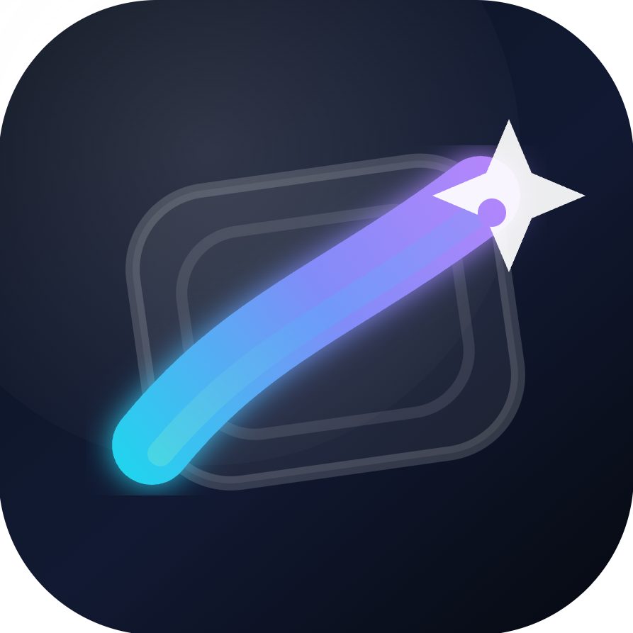

    
    <h1>AI Canvas</h1>
    <h3><em>One Space. All AI.</em></h3>

    <strong>An Electron desktop markdown canvas that turns conversations with AI into polished documents</strong>

    

---

## Motivation

Conversations with AI always stay confined to "chat." Even when great ideas emerge, you end up opening a separate document editor to organize them — losing context and flow along the way.

AI Canvas bridges this gap. The conversation itself becomes the document. AI doesn't just answer — it plans and edits the markdown document directly on the canvas. Switch freely between Gemini, Codex, and Claude in one workspace, leveraging each model's strengths to craft a single document.

## Features

### AI Providers

- **Gemini**: Google Cloud Code Assist API, OAuth 2.0 PKCE authentication
- **Codex**: OpenAI API, OAuth 2.0 authentication
- **Claude**: Anthropic API, OAuth 2.0 authentication

### Canvas Editor

- **WYSIWYG**: Rich markdown editing powered by Milkdown + ProseMirror
- **Math**: KaTeX mathematical formula rendering
- **Diagrams**: Mermaid diagram support
- **Code**: PrismJS syntax highlighting
- **Images**: Drag-and-drop / paste image asset management
- **Selection AI**: Instant AI question popup on text selection

### Project Management

- **Directory-based**: Designate a local folder as a project, documents stored in `.ai-canvas/`
- **Auto-save**: 1.2-second debounce auto-save with status indicator
- **Conversations**: Create and switch between multiple conversation sessions
- **Tab management**: Drag to reorder canvas file tabs, click to rename

### Export

- **Document export**: HTML, PDF, DOCX format support
- **Share bundle**: Share and import projects via dedicated `.aic` bundles

## Important Notes

- All documents are saved locally in the `.ai-canvas/` directory within the selected project folder
- The canvas is locked during Phase 2 execution, displaying an update overlay
- Production build: `npm run build`, Tests: `npm test` (Playwright)

## License

Copyright © 2026 AI Canvas. All rights reserved.
